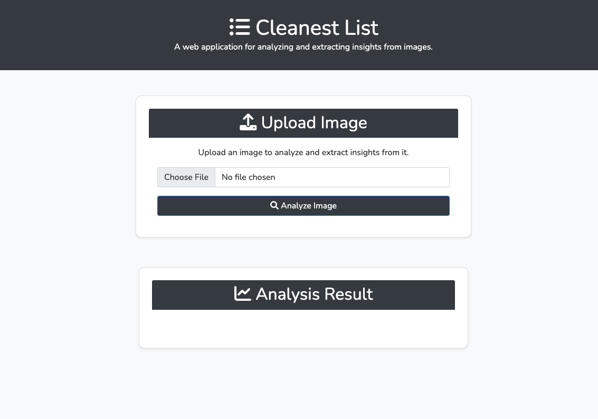

# Clean List

## Description

Cleanest List is a web application for analyzing and extracting insights from images. It uses OpenAI's GPT-4 model to
analyze the images and extract insights.


Cleanest List is a web application that uses OpenAI's GPT-4 model to analyze images and extract insights from them. It's built with Python and Flask for the backend, and HTML, CSS, and JavaScript for the frontend.

## Backend

The backend is written in Python and uses the Flask framework. The main file is `app.py`, which contains the application's routes and the `ImageAnalyzer` class.

### ImageAnalyzer Class

The `ImageAnalyzer` class is responsible for interacting with the OpenAI API. It has two main methods:

- `encode_image(image_path)`: This method opens an image file, reads its content, and encodes it into a base64 string.
- `analyze_image(image_path)`: This method uses the `encode_image` method to get a base64 string of an image, then sends a POST request to the OpenAI API with a payload containing the base64 string. The API's response is then returned.

The OpenAI API key is retrieved from an environment variable using `os.getenv('OPENAI_API_KEY')`.

### Routes

There are two routes in the application:

- `'/'`: This route renders the `index.html` template.
- `'/upload'`: This route handles the image upload. It checks if a file was uploaded, saves the file, and then uses the `ImageAnalyzer` class to analyze the image and return the analysis result.

## Frontend

The frontend is built with HTML, CSS, and JavaScript. The main file is `index.html`, which contains the structure of the web page. The CSS file `main.css` is used for styling, and the JavaScript file `main.js` is used for handling form submission and updating the analysis display.

### JavaScript

The `main.js` file contains several functions:

- `updateAnalysis(analysis)`: This function updates the analysis display with the analysis result.
- `handleFormSubmit(e)`: This function handles form submission. It sends an AJAX request to the `'/upload'` route and updates the analysis display with the response.
- `handleFileInputChange(e)`: This function handles file input change. It reads the selected file and displays a preview of the image.

## Cool Features

- **Image Analysis**: The application uses OpenAI's GPT-4 model to analyze images and extract insights, which is a unique and powerful feature.
- **Environment Variables**: The application uses environment variables for sensitive data like the OpenAI API key, which is a best practice for security.
- **AJAX**: The application uses AJAX for form submission, which provides a better user experience by not requiring a page reload.
- **Image Preview**: The application provides an image preview when a user selects an image, which is a nice user-friendly feature.
- **Progress Bar**: The application displays a progress bar while the image is being analyzed, which provides visual feedback to the user.

## Installation
1. Clone the repository:

```bash
git clone https://github.com/bantoinese83/Clean_list.git
```

2. Install the dependencies:

```bash
pip install -r requirements.txt
```

3. Run the application:

```bash
python app.py
```

## Usage

1. Upload an image.
2. Click on the "Analyze" button.
3. View the insights extracted from the image.

## Set up the environment variable for the OpenAI API key:

```bash
export OPENAI_API_KEY=your_api_key_here
```




This project uses a system prompt for the OpenAI API based on the work by [Daniel Miessler](https://github.com/danielmiessler). The original file can be found [here](https://github.com/danielmiessler/fabric/blob/main/patterns/extract_wisdom/system.md).